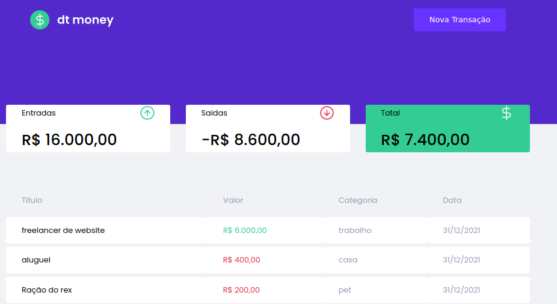

### DTMONEY

<p>
  Feito na trilha ignite de reactjs da rocketseat, um aplicativo simples de controle de finaças utilizando o basico do react. 
</p>


## Tópicos 

[Sobre o dt money](#sobre-o-dt-money)

[Tecnologias](#tecnologias)

[Instalação e uso](#instalação-e-uso)

[Licença](#licença)

<br>

## Sobre o dt money

O dt money é uma alternativa simples e eficaz para gerenciar suas finanças, permitindo o cadastro de entradas, saídas e a organização das mesmas em categorias.

<br>

<p align="center">
  
</p>

## Tecnologias

Tecnologias e ferramentas utilizadas no desenvolvimento do projeto:

- [React](https://reactjs.org/)
- [TypeScript](https://www.typescriptlang.org/)
- [Styled Components](https://styled-components.com/)
- [MirageJS](https://miragejs.com/)
- [Axios](https://github.com/axios/axios)
- [Polished](https://polished.js.org/)

<br>

## Instalação e uso

```bash
# Abra um terminal e copie este repositório com o comando
git clone https://github.com/Saiiru/dtmoney.git


# Entre na pasta web com 
cd dtmoney

# Instale as dependências
yarn 

# Rode a aplicação
yarn start
```

<br>


## Licença
```
 * ------------------------------------------------------------
 * "THE BEERWARE LICENSE" (Revision 42):
 * Saiiru wrote this code. As long as you retain this 
 * notice, you can do whatever you want with this stuff. If we
 * meet someday, and you think this stuff is worth it, you can
 * buy me a beer in return.
 * ------------------------------------------------------------
 ```


